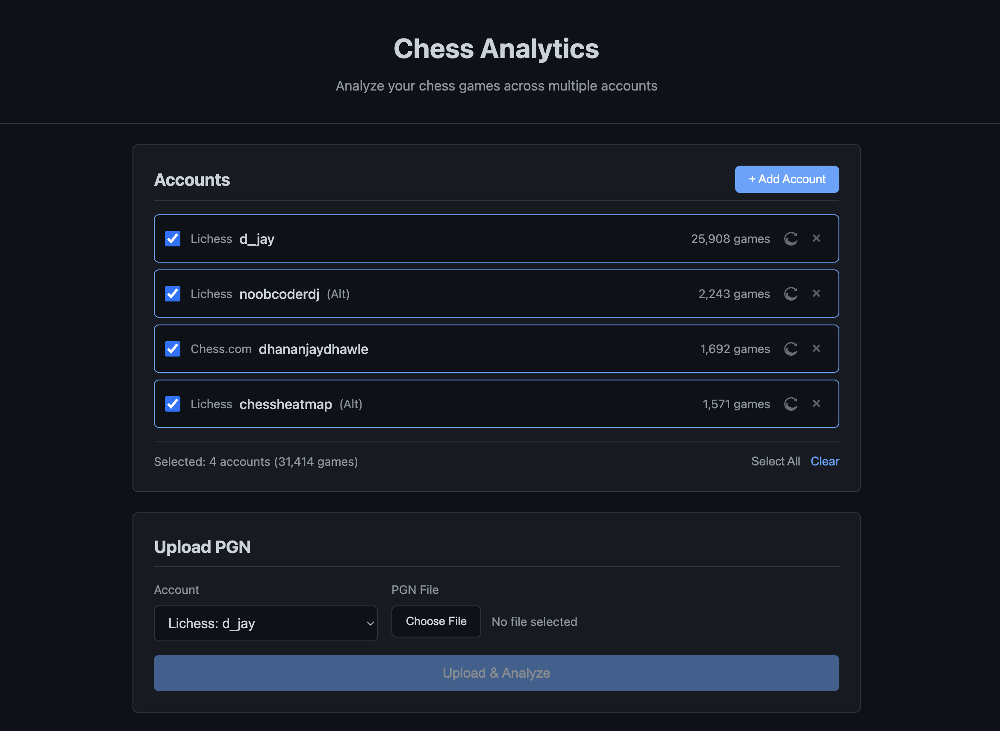
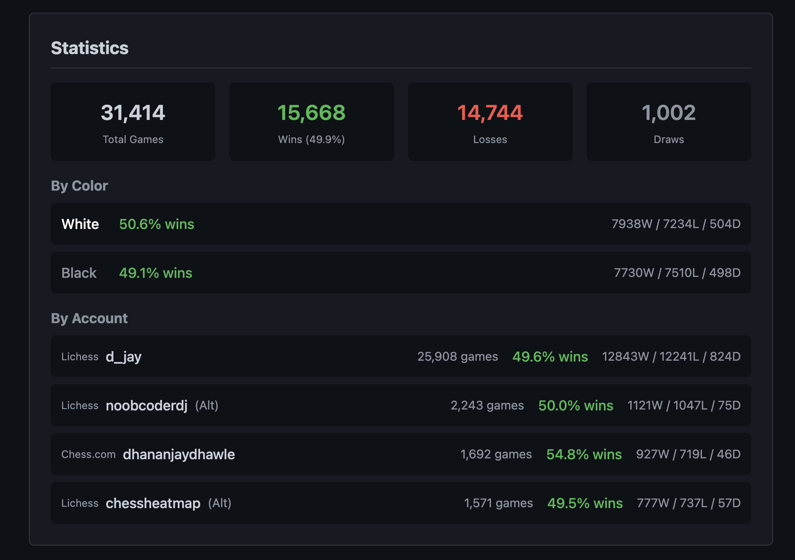
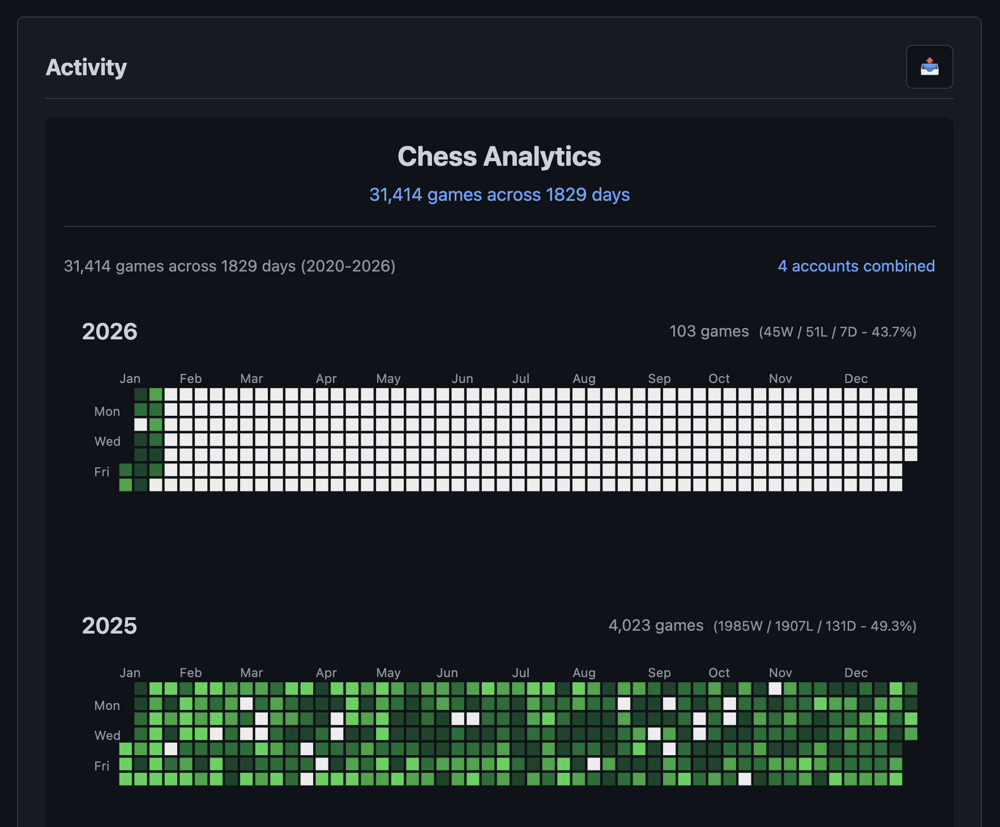
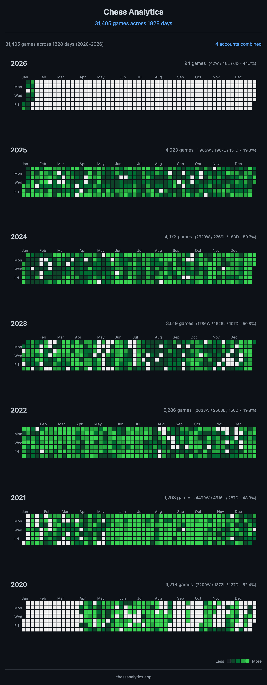

# Chess Analytics

A personal chess analytics web application that helps you track, analyze, and visualize your chess games across multiple platforms. Import your games from Chess.com, Lichess, or upload PGN files directly to get comprehensive statistics and beautiful activity heatmaps.

## Screenshots

### Account Management & Upload


Manage multiple chess accounts from different platforms. Upload PGN files or import directly via API.

### Statistics Dashboard


View detailed win/loss/draw statistics broken down by color and account.

### Activity Heatmap


Multi-year calendar heatmap showing your chess activity over time with game counts per day.

### Calendar Heatmap Detail


## Features

### Multi-Account Support
- Add and manage multiple chess accounts from Chess.com, Lichess, or other platforms
- Track games from all accounts combined or filter by individual account
- Add custom labels to accounts for easy identification

### Game Import Options
- **PGN File Upload**: Upload large PGN files (up to 100MB) containing thousands of games
- **Chess.com API Import**: Direct import from Chess.com using their public API
- **Lichess API Import**: Direct import from Lichess with streaming support
- Asynchronous processing with real-time progress tracking

### Analytics & Visualization
- **Multi-Year Calendar Heatmap**: Interactive activity visualization showing game frequency per day across multiple years
- **Statistics Dashboard**: Aggregate win/loss/draw statistics with percentages
- **Color Breakdown**: See your performance as White vs Black
- **Per-Account Stats**: Compare performance across different accounts

### Filtering Options
- Filter by time control: Ultrabullet, Bullet, Blitz, Rapid, Classical, Correspondence
- Filter by player color: White or Black
- Filter by specific account or view all combined

### Smart Data Management
- Automatic duplicate detection using SHA-256 hashing
- Automatic time control categorization from PGN data
- Case-insensitive username matching

## Tech Stack

**Backend:**
- Java 21
- Spring Boot 3.2
- Spring Data JPA with Hibernate
- H2 Database (file-based)

**Frontend:**
- React 18
- TypeScript
- Vite (build tool with hot reload)
- React Calendar Heatmap

## Project Structure

```
chess-analytics/
├── backend/
│   └── src/main/java/com/chessanalytics/
│       ├── controller/     # REST endpoints
│       ├── service/        # Business logic
│       ├── parser/         # PGN parsing
│       ├── repository/     # Data access
│       ├── model/          # Entities & enums
│       ├── dto/            # Request/Response objects
│       └── config/         # Configuration
├── frontend/               # React application
├── images/                 # Screenshots
└── data/
    ├── uploads/            # Stored PGN files
    └── chess.mv.db         # H2 database file
```

## Quick Start

### Prerequisites

- Java 21
- Maven 3.8+
- Node.js 18+ (for frontend)

### Running the Backend

```bash
cd backend
./mvnw spring-boot:run
```

The API will be available at `http://localhost:8080`

### Running the Frontend

```bash
cd frontend
npm install
npm run dev
```

The frontend will be available at `http://localhost:5173`

### Database

H2 database is created automatically at `data/chess.mv.db` on first run.

H2 Console available at `http://localhost:8080/h2-console` for debugging.

## Time Control Categories

Games are automatically categorized based on their time control:

| Category | Time Range |
|----------|------------|
| Ultrabullet | < 30 seconds |
| Bullet | 30 seconds - 3 minutes |
| Blitz | 3 - 10 minutes |
| Rapid | 10 - 30 minutes |
| Classical | > 30 minutes |
| Correspondence | Turn-based games |

## API Reference

### Accounts

| Method | Endpoint | Description |
|--------|----------|-------------|
| POST | `/api/accounts` | Create account |
| GET | `/api/accounts` | List all accounts |
| GET | `/api/accounts/{id}` | Get account |
| PUT | `/api/accounts/{id}` | Update account label |
| DELETE | `/api/accounts/{id}` | Delete account |

**Create Account Request:**
```json
{
  "platform": "CHESS_COM",
  "username": "your_username"
}
```

Platforms: `CHESS_COM`, `LICHESS`, `OTHER`

### Upload & Import Games

| Method | Endpoint | Description |
|--------|----------|-------------|
| POST | `/api/accounts/{id}/upload` | Upload PGN file |
| POST | `/api/accounts/{id}/import/chesscom` | Import from Chess.com API |
| POST | `/api/accounts/{id}/import/lichess` | Import from Lichess API |
| GET | `/api/accounts/{id}/jobs/{jobId}` | Check upload/import status |

**Upload Request:**
```bash
curl -X POST http://localhost:8080/api/accounts/1/upload \
  -F "file=@games.pgn"
```

**Job Status Response:**
```json
{
  "id": 1,
  "accountId": 1,
  "status": "PROCESSING",
  "totalGames": 5000,
  "processedGames": 2500,
  "duplicateGames": 100,
  "progressPercent": 50
}
```

Status values: `PENDING`, `PROCESSING`, `COMPLETED`, `FAILED`

### Analytics

| Method | Endpoint | Description |
|--------|----------|-------------|
| GET | `/api/analytics/calendar/multi-year` | Multi-year calendar data |
| GET | `/api/analytics/stats/multi-account` | Stats with per-account breakdown |

**Query Parameters:**
- `accountIds` - Comma-separated account IDs (optional, defaults to all)
- `timeControl` - Filter by category: `ULTRABULLET`, `BULLET`, `BLITZ`, `RAPID`, `CLASSICAL`, `CORRESPONDENCE`
- `color` - Filter by color: `WHITE`, `BLACK`

**Multi-Year Calendar Response:**
```json
{
  "data": [
    { "date": "2024-01-15", "count": 12 },
    { "date": "2024-01-16", "count": 5 }
  ],
  "totalGames": 31414,
  "totalDays": 1829,
  "dateRange": {
    "start": "2020-01-01",
    "end": "2026-01-17"
  }
}
```

**Stats Response:**
```json
{
  "total": 31414,
  "wins": 15668,
  "losses": 14744,
  "draws": 1002,
  "byColor": {
    "WHITE": { "wins": 7938, "losses": 7234, "draws": 504 },
    "BLACK": { "wins": 7730, "losses": 7510, "draws": 498 }
  },
  "byAccount": [
    { "accountId": 1, "username": "d_jay", "total": 25908, "wins": 12843, "losses": 12241, "draws": 824 }
  ]
}
```

## Troubleshooting

### Upload times out
Large files (30k+ games) may take several minutes to process. The upload endpoint returns immediately with a job ID - poll the job status endpoint for progress.

### Games not appearing
- Check that your username in the account matches the username in the PGN file (case-insensitive)
- Duplicate games are automatically skipped based on a hash of the game data

### API import fails
- Chess.com and Lichess have rate limits. The app handles these automatically with retries
- Ensure the username exists on the platform
- Check that the account's games are publicly accessible

### Java version issues
Ensure you're running Java 21:
```bash
java -version
```

## Development Notes

- Async processing with `@Async` for large file uploads and API imports
- Streaming PGN parser for memory efficiency (handles 30k+ games)
- SHA-256 hash for duplicate detection
- Rate limiting compliance for Chess.com (500ms delays) and Lichess APIs
- Indexed database queries for analytics performance
